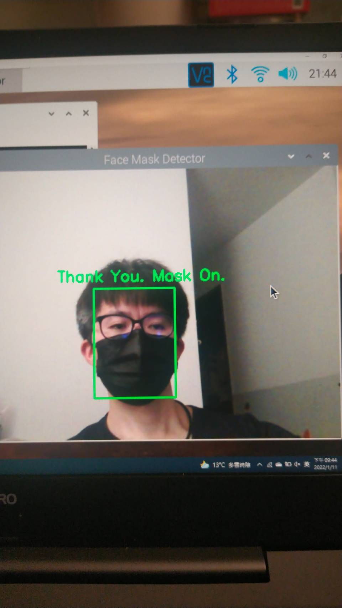

# -口罩偵測示警功能 應用於Raspi 4.
綜觀:
COVID-19的影響下，近年的口罩政策，無法快速地解除戴口罩的現象。
導致因未正確配戴口罩，經糾正後發生的攸關生命安全的社會事件，如在商業空間中，有偵測口罩的設備提醒違規者，可避免掉不必要的寶貴生命失去。
這是一個基礎型的口罩偵測端點系統，透過WEBCAM設備進行人臉判斷是否有戴口罩警示的功能，初期以edge 方式呈現功能，後續還可以加入上傳雲端做相關分析動作。

# -使用相關軟硬體設備
Hardward

Raspberry Pi 4 *1

Sony Webcam *1

Jumper wires

breadboard *1

LED red *1 , green *1

power adapter / cable *1

Software

Python 3.7

Tensorflow 2.1

OPEN CV

imutils

# -Raspberry Pi 面罩檢測器項目如何工作？

當用戶接近您的網絡攝像頭時，利用 TensorFlow、OpenCV 和 imutils 包的 Python 代碼將檢測用戶是否佩戴口罩。 
戴口罩的人員將在其臉部周圍看到一個綠色框，上面寫著“Thank you. Mask On.” 

不戴口罩的人員會在他們的臉上看到一個紅色框，上面寫著“No Face Mask Detected.”

# -樹莓派面罩檢測器項目是如何進行的？
  ## -Part 1 安裝相關軟體 OpenCV, imutils, Tensorflow 三個套件
  OpenCV 用於處理具有機器學習功能的實時圖像和視頻。
  Imutils 用於加快 Raspberry Pi 上的 OpenCV 計算。
  Tensorflow  google 開發，是一個開源機器學習平台。
    1. 安裝RasPI OS，可參考連結 https://www.tomshardware.com/reviews/raspberry-pi-set-up-how-to,6029.html 
    2. 透過VNC 方式連線， 簡化設備使用，可參考連結 https://www.tomshardware.com/reviews/raspberry-pi-headless-setup-how-to,6028.html
    3. 安裝本次使用的WEBCAM 和相關電路設備，並開啟電源確認是否可以透過VNC 連線。
    4. 安裝 OpenCV。有關安裝 OpenCV 的完整說明，請參閱連結  https://medium.com/linux-on-raspberry-pi4/raspberry-pi%E5%AE%89%E8%A3%9Dopencv-%E5%AE%89%E8%A3%9D%E7%AF%87-1e6e35051680
    5. 安裝 TensorFlow.
     sudo pip3 install https://github.com/lhelontra/tensorflow-on-arm/releases/download/v2.1.0/tensorflow-2.1.0-cp37-none-linux_armv7l.whl
    6. 安裝 imutils。
     sudo pip3 install imutils
    7. 參考網路上已有開發的相關detector code, https://github.com/CircuitDigest/Face-Mask_detection
     和模型驗證，https://circuitdigest.com/microcontroller-projects/face-mask-detection-using-raspberry-pi-and-opencv
     https://github.com/carolinedunn/face_mask_detection
    8. 此階段系統安裝Tensorflow 需要確認OS 版本與Tensorflow 支援的版本，此時間點實作驗證，Raspi OS Bulleyes 目前無法搭配Tensorflow 相關本本使用，故在安裝上會無法完成。
  ## -Part 2 測試口罩偵測功能 (利用已訓練好的 Model)
  將先跳過模型訓練並運行預製模型來識別您是否戴口罩，利用網路上已流傳的model做使用。
    1.開啟終端機視窗
    2.運行使用 1,000 多張圖像訓練的預製模型 (mask_detector.model)。 在您的終端更改目錄 (cd) 中，進入目錄(face_mask_detection)。
      cd face_mask_detection    
    3.執行Python 3 代碼開啟網絡攝像頭並啟動口罩演算法。
      python3 detect_mask_webcam.py
      幾秒鐘後，會看到您的桌面彈出視窗，並看到一個綠色框，指示面罩存在。
      
      
  
  
     
